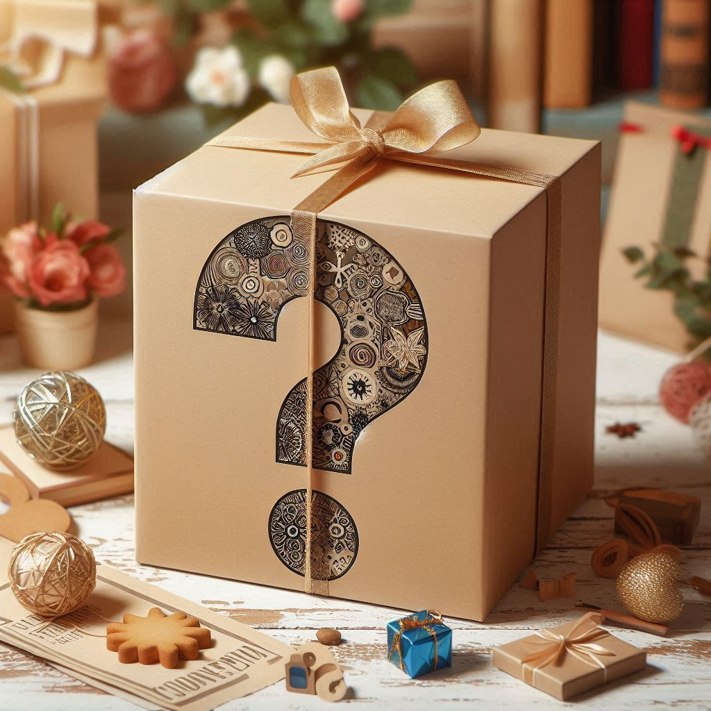

# Challenge Amigo Secreto 

Projeto  desenvolvido durante o programa de educação ONE - Oracle Next Education. Este projeto faz parte da trilha de educação Iniciante em Programação G8 - ONE.

## Índice
- <a href="#funcionalidades"> Funcionalidades do projeto</a>
- <a href="#tecnologias"> Tecnologias</a>
- <a href="#autor"> Autor</a>

### Funcionalidades do projeto
 Sorteio aleatório automatizado sem influência humana. 

### Tecnologias
Embora o projeto tenha as linguagens HTML, CSS e JavaSript, apenas a linguagem Javascript foi avaliada e desenvolvida do zero. Todos outros elementos e linguagens fazem parte de um modelo já pronto. 

## Autor
Criado por Filipe de Oliveira, estudante e graduando em Gestão da Tecnologia da Informação. Entusiasta de tecnologia, com foco em análise de dados.

